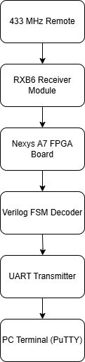

# fpga-rf-packet-decoder
FPGA Verilog project to decode real-world 433 MHz RF packets in real time.

# FPGA-Based 433 MHz Wireless Packet Decoder

This project decodes 433.920 MHz RF signals from wireless remotes in real-time using Verilog on a Nexys A7 FPGA.  
The RF pulse train is captured by a receiver module and decoded by a finite state machine (FSM), then output over UART to a terminal.

## ⚙️ System Architecture

*Planned stretch goal: Add OLED display output using SSD1306 module via I2C.*

# FPGA 433 MHz Wireless Packet Decoder

This project uses a Nexys A7 FPGA to decode 433.920 MHz wireless remote signals in real-time.  
A simple RF receiver module (RXB6) captures the pulses, which are processed by a Verilog finite state machine.  
Decoded data is sent to a PC over UART and displayed live in a terminal window (PuTTY).

---

## System Overview

- **Remote Control** sends OOK (on-off keying) pulses at 433 MHz.
- **RXB6 Module** picks up the RF pulses.
- **Nexys A7 FPGA** measures pulse widths and decodes them with a custom FSM.
- **UART Transmitter** sends decoded bits to a PC terminal over USB.

---

## Repo Structure

| Folder | Purpose |
|:---|:---|
| `/src` | Verilog source code (FSM, UART, top-level module) |
| `/doc` | Timing diagrams, system diagrams, protocol notes |
| `/captures` | SDR# screenshots and signal captures |
| `/images` | Terminal output, hardware setup photos |
| `/testbench` | Simulation files (to be added) |
| `/xdc` | Vivado constraint files for FPGA pin mapping |

---

## Project Status

- RTL-SDR capture working ✅
- RXB6 module testing in progress 🛠️
- FSM design started 🛠️
- UART output module in planning phase 🛠️

---

## Goals

- Build a working pulse-width decoding FSM.
- Output decoded packets via UART to PC.
- (Stretch Goal) Display decoded data on an OLED screen.

---

## Why This Project

I wanted a hands-on way to practice both RF signal processing and FPGA design.  
This project combines radio protocol analysis, real-time signal decoding, Verilog development, and embedded system communication — all in one pipeline.

---

## License

MIT

